## Advanced Lane Finding Project

This repository contains code I did for `Advanced Lane Finding Project` from [Udacity's Self Driving Car Nano Degree Program](https://www.udacity.com/drive). 

---

The **steps** of this project are the following:

* Compute the camera calibration matrix and distortion coefficients given a set of chessboard images.
* Apply a distortion correction to raw images.
* Apply a perspective transform to rectify binary image ("birds-eye view").
* Use color transforms, gradients, etc., to create a thresholded binary image.
* Detect lane pixels and fit to find the lane boundary.
* Determine the curvature of the lane and vehicle position with respect to center.
* Warp the detected lane boundaries back onto the original image.
* Output visual display of the lane boundaries and numerical estimation of lane curvature and vehicle position.

[//]: # (Image References)

[image1_1]: ./camera_cal/calibration2.jpg "distorted"
[image12]: ./test_images/calibrated2.jpg "distortion-corrected"
[image2]: ./test_images/test1.jpg "Road Transformed"
[image3]: ./examples/binary_combo_example.jpg "Binary Example"
[image4]: ./examples/warped_straight_lines.jpg "Warp Example"
[image5]: ./examples/color_fit_lines.jpg "Fit Visual"
[image6]: ./examples/example_output.jpg "Output"
[video1]: ./project_video.mp4 "Video"


### 1. Camera Calibration

In this step, the camera matrix and distortion coefficients are calculated. An example of a distortion corrected calibration image is shown below:


<table><tr>
<td><figure>
    
    <figcaption>Distorted</figcaption>
    </figure></td>
<td><figure>
    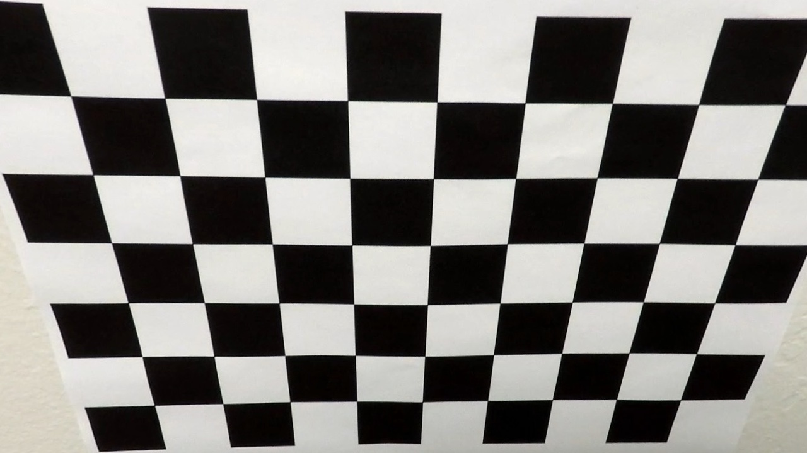
    <figcaption>Distortion-corrected</figcaption></figure></td>
</tr></table>


### 2. Apply distortion-correction to raw image.

To demonstrate this step, the same distortion correction is appled to one of the test images like this one:
<table><tr>
<td><figure>
    
    <figcaption>Distorted</figcaption>
    </figure></td>
<td><figure>
    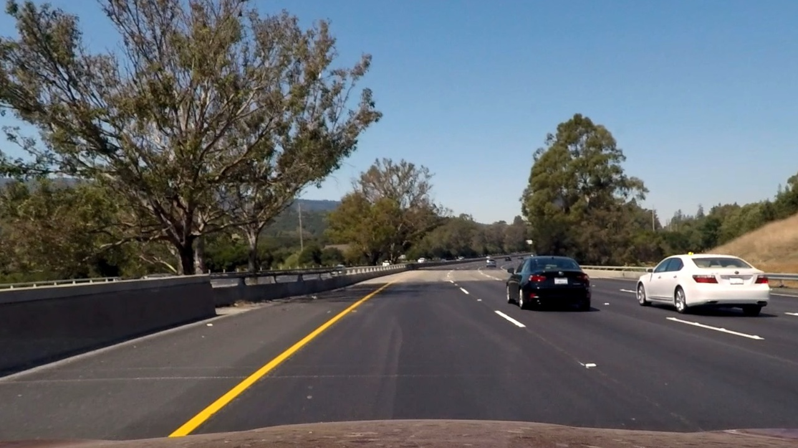
    <figcaption>Distortion-corrected</figcaption></figure></td>
</tr></table>

### 3. Performed a perspective transform and provide an example of a transformed image.

The code for perspective transform is included: 
First the source points and destination points are defined as shown below:
```python
src = np.float32([[205,720],[565,470],[720,470],[1100,720]])
h, w = img.shape[:2]
dst = np.float32([[350, 720],[350, 0],[w-350, 0],[w-350, 720]])
```

This resulted in the following source and destination points:

| Source        | Destination   | 
|:-------------:|:-------------:| 
| 205, 720      | 350, 720        | 
| 565, 470      | 350, 0      |
| 720, 470     | 930, 0      |
| 1100, 720      | 930, 720        |

It is verified that the perspective transform was working as expected by drawing the `src` and `dst` points onto a test image and its warped counterpart to verify that the lines appear parallel in the warped image.

<table><tr>
<td><figure>
    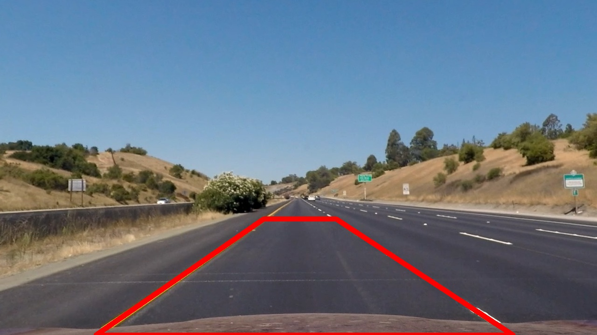
    <figcaption>Test image</figcaption>
    </figure></td>
<td><figure>
    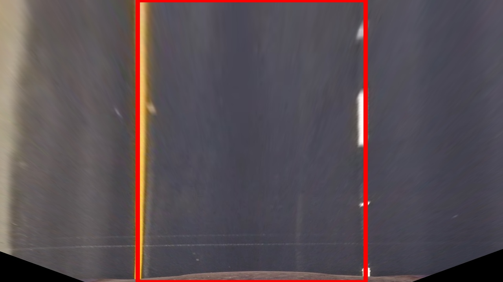
    <figcaption>Warped image</figcaption></figure></td>
</tr></table>

### 4.Using color transforms, gradients  to create a thresholded binary image.  Provide an example of a binary image result.

The color space been explored include:
* RGB:    
*** Red channel is chosen with threshold of 215/255
* HLS:    
*** S channel is chosen with threshold of 210/255
* HSV:     
*** V channel is chosen with threshold of 220/255
* The code for all three above color space are of the same template, therefore the code for LUV is ignored   
*** V channel in LUV is chosen with threshold of 155/255

* X Gradient is chosen with threshold of 14/100

The following table :heavy_check_mark:  shows  the  channels which generate highest lane information

---------------------------------------------    
#### Observations in RGB color space:

| images  | Red(215,255)   | Green(195,255)   | Blue(60,210)   | Notes |
|:--------:|:--------------:|:--------------:|:--------------:|:--------------:|
|straigh_line1.jpg| :heavy_check_mark:| :heavy_check_mark:|  | |
|straigh_line2.jpg| :heavy_check_mark:| :heavy_check_mark:|  | |
|test1.jpg| :heavy_check_mark:|  |  | bright picture|
|test2.jpg| :heavy_check_mark:| :heavy_check_mark:|  ||
|test3.jpg| :heavy_check_mark:| :heavy_check_mark:| ||
|test4.jpg| :heavy_check_mark:| |  |bright picture|
|test5.jpg|  |  |   | with shadow|
|test6.jpg| :heavy_check_mark:|  |   ||

<table><tr>
<td><figure>
    <figcaption>Warped Image</figcaption>
    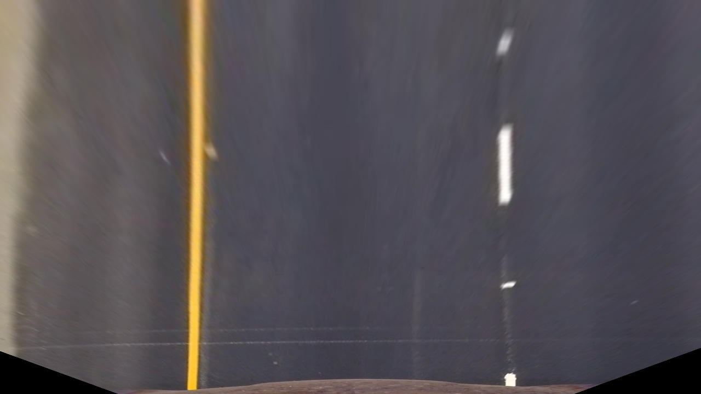
    </figure></td>
<td><figure>
    <figcaption>Lanes info in Red channel</figcaption>
    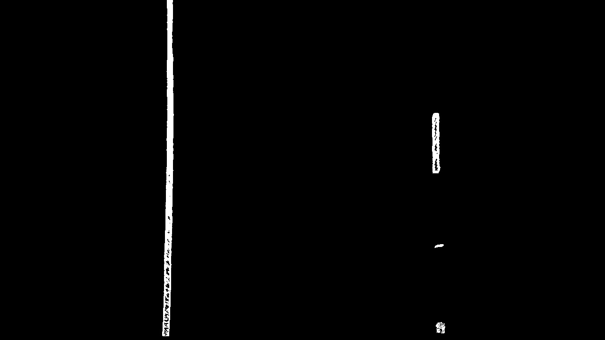
</figure></td>
</tr></table>


---------------------------------------------
#### Observations in HLS color space:
| images  | H(14,85)   | L(120,255)   | S(210,255)   | Notes |
|--------|--------------|--------------|--------------|--------------|
|straigh_line1.jpg| |:heavy_check_mark:| | |
|straigh_line2.jpg| | :heavy_check_mark:|  | |
|test1.jpg| | |:heavy_check_mark:| bright picture|
|test2.jpg| |:heavy_check_mark:|  ||
|test3.jpg| |:heavy_check_mark:| ||
|test4.jpg| | | :heavy_check_mark: |bright picture|
|test5.jpg| | | | with shadow|
|test6.jpg| | :heavy_check_mark:|   ||
<table><tr>
<td><figure>
    <figcaption>Warped Image</figcaption>
    
    </figure></td>
<td><figure>
    <figcaption>Lanes info in S/HLS channel</figcaption>
    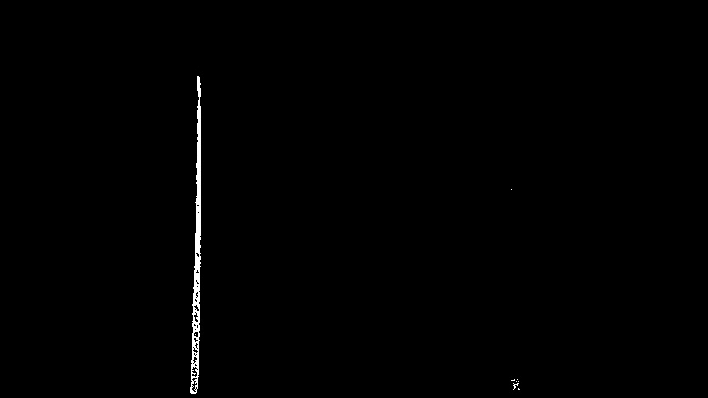
</figure></td>
</tr></table>

----------------------------------------
#### Observations in HSV color space:
| images  | H(14,85)   | S(80,255)   | V(220,255)   | Notes |
|--------|--------------|--------------|--------------|--------------|
|straigh_line1.jpg| ||:heavy_check_mark:| |
|straigh_line2.jpg| || :heavy_check_mark:| |
|test1.jpg| | | :heavy_check_mark:| bright picture|
|test2.jpg| | |:heavy_check_mark:|  ||
|test3.jpg| | |:heavy_check_mark:||
|test4.jpg| | | :heavy_check_mark: |bright picture|
|test5.jpg| | | | with shadow|
|test6.jpg| | | :heavy_check_mark:||
<table><tr>
<td><figure>
    <figcaption>Warped Image</figcaption>
    
    </figure></td>
<td><figure>
    <figcaption>Lanes info in V/HSV channel</figcaption>
    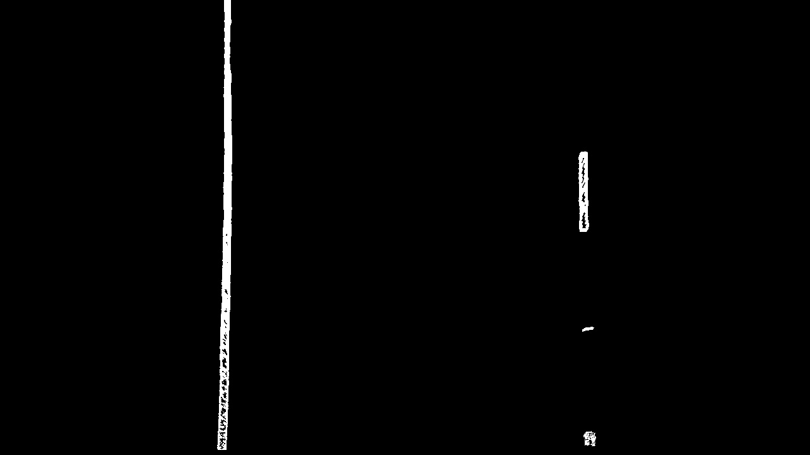
</figure></td>
</tr></table>

----------------------------
#### Observations of gradient:
| images  | X(14,100)   | Y(0,255)   | ABS(0,255)   | Notes |
|--------|--------------|--------------|--------------|--------------|
|straigh_line1.jpg| :heavy_check_mark:||| |
|straigh_line2.jpg| :heavy_check_mark:|| | |
|test1.jpg| | | | bright picture|
|test2.jpg|:heavy_check_mark: | ||  ||
|test3.jpg|:heavy_check_mark: | |||
|test4.jpg| | |  |bright picture|
|test5.jpg|:heavy_check_mark: | | | with shadow|
|test6.jpg| :heavy_check_mark:| | ||
<table><tr>
<td><figure>
    <figcaption>Warped Image</figcaption>
    
    </figure></td>
<td><figure>
    <figcaption>Lanes info in X_gradient channel</figcaption>
    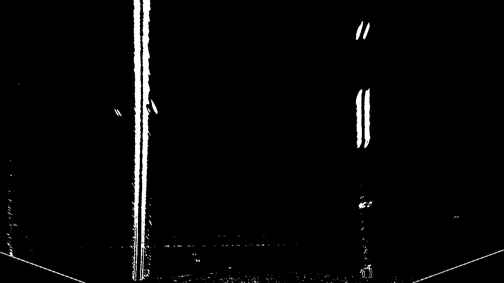
</figure></td>
</tr></table>


### The final combined image is:
The final combined image is the sume of all above images, then set pixel value <=1 as 0
<figure>
    <figcaption>            Lanes info in final combined image</figcaption>
    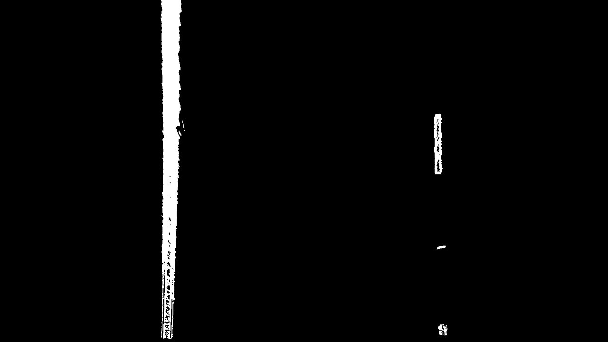
</figure>


### 5. Identified lane-line pixels and fit their positions with a polynomial?

Function 'find_lane_pixels(binary_warped)' is to find pixels belonging to left lane and right lane.

The histogram of the first video frame is calculated, and the two highest points of the histogram are taken as the lane starting points.  

Two sliding windows are defined for both left and right lanes and been moved upward to search all potential lane pixels.   

The a 2nd-order polynomial lines are calculated to fit those lane pixels. 

<table><tr>
<td><figure>
    <figcaption>Original Image</figcaption>
    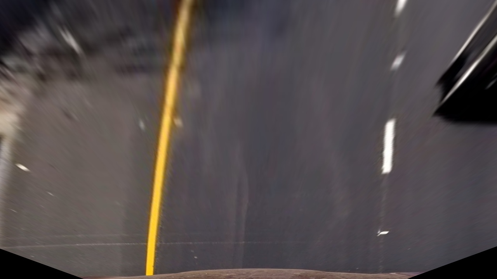
    </figure></td>
<td><figure>
    <figcaption>Curve_fit image</figcaption>
    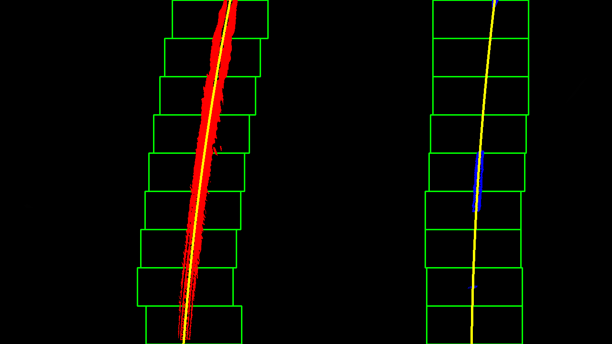
</figure></td>
</tr></table>

### 6. Calculate the radius of curvature of the lane and the position of the vehicle with respect to center.

The curvatures are calculated as:
First define meters per pix in both x and y direction
```python
my_per_pix = 30/ 720
mx_per_pix = 3.7/ 700
```
Then find the 2nd order polynominal curve fitting for both left and right lanes
```python
left_fit = np.polyfit(lefty, leftx, 2)
right_fit = np.polyfit(righty, rightx, 2)
```

Then conver those coefficients 'left_fit' and 'right_fit', which have unit in pixels, to unit in 'meter'

```python
left_fit_cr_0 = mx_per_pix / my_per_pix**2 * left_fit[0]
left_fit_cr_1 = mx_per_pix / my_per_pix * left_fit[1]
right_fit_cr_0 = mx_per_pix / my_per_pix**2 * right_fit[0]
right_fit_cr_1 = mx_per_pix / my_per_pix * right_fit[1]    
```
The curvature is calculated as:
```python
left_curverad = ((1 + (2*left_fit_cr_0*y_eval*my_per_pix + left_fit_cr_1)**2)**1.5) / np.absolute(2*left_fit_cr_0)
right_curverad = ((1 + (2*right_fit_cr_0*y_eval*my_per_pix + right_fit_cr_1)**2)**1.5) / np.absolute(2*right_fit_cr_0)
```
based on the following equation:
\begin{equation*}
R_{curve} =\frac{(1+(2Ay+B)^2)^{\frac32})}{|2A|}
\end{equation*}

### 7. An example image of result plotted back down onto the road such that the lane area is identified clearly.

I implemented this step in cell $15$.  Here is an example of my result on a test image:

<figure>
    <figcaption>Image with lane area</figcaption>
    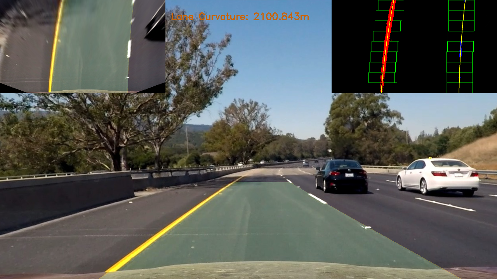
</figure>

---

### Pipeline (video)

### 8. A link to your final video output.  Your pipeline should perform reasonably well on the entire project video (wobbly lines are ok but no catastrophic failures that would cause the car to drive off the road!).

Here's a [link to my video result](./output_videos/final_video.mp4)

---
