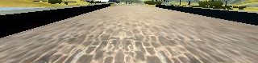
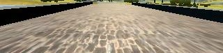
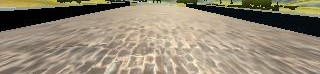

# **Behavioral Cloning**

---

**Behavioral Cloning Project**

The goals / steps of this project are the following:
* Use the simulator to collect data of good driving behavior
* Build, a convolution neural network in Keras that predicts steering angles from images
* Train and validate the model with a training and validation set
* Test that the model successfully drives around track one without leaving the road
* Summarize the results with a written report

**Training Data**

Training data was chosen to keep the vehicle driving on the road. The input data to the model are camara images and steering angle. There are three camera images: left, center and right
<table><tr>
<td><figure>
    
    <figcaption>Left</figcaption>
    </figure></td>
<td><figure>
    
    <figcaption>Center</figcaption>
    </figure></td>
<td><figure>
    
    <figcaption>Right</figcaption>
    </figure></td>    
</tr></table>

----
The file paths for those images are stored in .csv file together with steering angle values
<figure>
    <figcaption>Input data</figcaption>
    
</figure>


### Model Architecture and Training Strategy

#### 1. Solution Design Approach
The first step is image preprocessing:
* Normalization
* Image cropping

**Normalization**
```python
model.add(Lambda(lambda x: x/255.0 - 0.5,input_shape=(160,320,3)))
```
**Image cropping**
The reason for this step is that, for each camera image, the top half shows sky or tree, which could be noise for model training. To make training easier, the tree/sky and front part of vechile are cropped away, the following figures give some examples:

<table><tr>
<td><figure>
    
    <figcaption>Left</figcaption>
    </figure></td>
<td><figure>
    
    <figcaption>Center</figcaption>
    </figure></td>
<td><figure>
    
    <figcaption>Right</figcaption>
    </figure></td>    
</tr></table>

The first network used is `Lenet` convolution neural netowrk. The model showed controlling steering to keep vehicle to the center of the road. But couldn't go to far. 
In order to improve the overall model performance, two data augmentation schemes are done"
* Using all three camera images
* Flip all the images

**Using all three camera images**

```python
                for i in range(3):
                    source_path = line[i]
                    filename = source_path.split('/')[-1]
                    current_path = './data/IMG/' + filename
                    image = cv2.imread(current_path)
                    batch_images.append(image)
                    angle = steering_center
                    if i==1: #if data from left camera add correction
                        angle +=correction
                    if i==2: #if data from right camera add minus correction
                        angle -=correction
```
For left camera image, the steering angle is set to 0.25, and -0.25 for images from the right camera

**Flip all the images**
```python
                    batch_angles.append(angle)
                    #flip image to augment data
                    batch_images.append(cv2.flip(image,1))
                    batch_angles.append(angle*(-1.0))
```
When an images is flipped, its angle should be inversed

After image augmentation, the Lenet model performance showed some improvement

**Overfitting**
To avoid overfitting, dropout layers are inserted in between fully connected layers"
```python
model.add(Flatten())
model.add(Dense(100))
model.add(Dropout(0.5))
model.add(Dense(50))
model.add(Dropout(0.2))
model.add(Dense(10))
model.add(Dense(1))
```

**The final model is shown below**
```
_________________________________________________________________
Layer (type)                 Output Shape              Param #   
=================================================================
lambda_2 (Lambda)            (None, 160, 320, 3)       0         
_________________________________________________________________
cropping2d_2 (Cropping2D)    (None, 65, 320, 3)        0         
_________________________________________________________________
conv2d_6 (Conv2D)            (None, 31, 158, 24)       1824      
_________________________________________________________________
conv2d_7 (Conv2D)            (None, 14, 77, 36)        21636     
_________________________________________________________________
conv2d_8 (Conv2D)            (None, 5, 37, 48)         43248     
_________________________________________________________________
conv2d_9 (Conv2D)            (None, 3, 35, 64)         27712     
_________________________________________________________________
conv2d_10 (Conv2D)           (None, 1, 33, 64)         36928     
_________________________________________________________________
flatten_2 (Flatten)          (None, 2112)              0         
_________________________________________________________________
dense_5 (Dense)              (None, 100)               211300    
_________________________________________________________________
dropout_3 (Dropout)          (None, 100)               0         
_________________________________________________________________
dense_6 (Dense)              (None, 50)                5050      
_________________________________________________________________
dropout_4 (Dropout)          (None, 50)                0         
_________________________________________________________________
dense_7 (Dense)              (None, 10)                510       
_________________________________________________________________
dense_8 (Dense)              (None, 1)                 11        
=================================================================
Total params: 348,219
Trainable params: 348,219
Non-trainable params: 0

```

With this final model, the vehicle is able to drive autonomously around the track without leaving the road.
