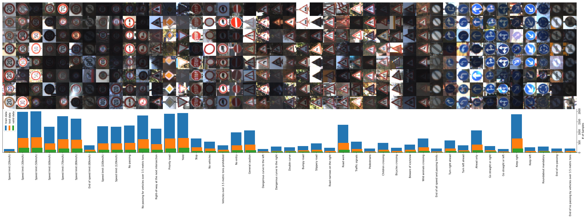
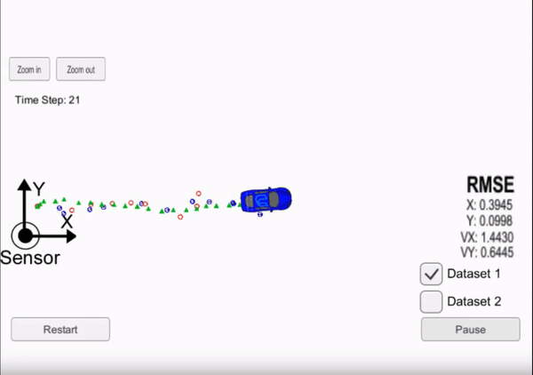

# Self-Driving Car

---

    
First apply computer vision and deep learning to automotive problems, including detecting lane lines, predicting steering angles, and more.
Next, learn about sensor fusion, to filter data from an array of sensors in order to perceive the environment. Then, you'll work with a team to program Carla, Udacity’s real self-driving car. 

---

## Projects

### [Project 1: Advanced Lane Line Detection](https://github.com/darrickz/Self_Driving_Car/tree/init_dev/CarND-Advanced-Lane-Lines)

In this project, the goal is to write a software pipeline to identify the lane boundaries in a video
* Compute the camera calibration matrix and distortion coefficients given a set of chessboard images.
* Apply a distortion correction to raw images.
* Use color transforms, gradients, etc., to create a thresholded binary image.
* Apply a perspective transform to rectify binary image ("birds-eye view").
* Detect lane pixels and fit to find the lane boundary.
* Determine the curvature of the lane and vehicle position with respect to center.
* Warp the detected lane boundaries back onto the original image.
* Output visual display of the lane boundaries and numerical estimation of lane curvature and vehicle position

<figure>
    

    <kbd>
    
    
    
    </kbd>    
    
Advanced Lane Line Detection

</figure>

---

### [Project 2: Traffic Sign Classification](https://github.com/darrickz/Self_Driving_Car/tree/init_dev/CarND-Traffic-Sign-Classifier)

In this project, a convolutional neural network is implemented to classify traffic signs. The traffic sign images is the German Traffic Sign Dataset.

   * Load the data set
   * Explore, summarize and visualize the data set
   * Design, train and test a model architecture
   * Use the model to make predictions on new images
   * Analyze the softmax probabilities of the new images
   * Summarize the results with a written report

<figure>
    
    
Data Distribution

---

### [Project 3: Extended Kalman Filter](https://github.com/darrickz/Self_Driving_Car/tree/init_dev/CarND-Extended-Kalman-Filter)

Utilize a kalman filter to estimate the state of a moving object of interest with noisy lidar and radar measurements.

<figure>
    

    <kbd>
    
    </kbd>
    

</figure>

---

### [Project 4: Kidnapped Vehicle](https://github.com/darrickz/Self_Driving_Car/tree/init_dev/CarND-Kidnapped-Vehicle)

Figure out the Vehicle location based on map, a noisy GPS estimate, and other sensors data

<figure>
    
<kbd>    
    
    </kbd>

</figure>

---

### [Project 5: Behavioral Cloning](https://github.com/darrickz/Self_Driving_Car/tree/init_dev/CarND-Behavioral-Cloning)

Using deep neural networks and convolutional neural networks to clone driving behavior. Model is trained, validated and tested using Keras, and output a sterring angle to an autonomous vehicle

<figure>
    
<kbd>        
    
    </kbd>
        
    
Behavioral Cloning

</figure>

---

### [Project 6: PID Control](https://github.com/darrickz/Self_Driving_Car/tree/init_dev/CarND-PID-Control)

This project is to develop a PID controller given the cross track error (CTE) and the velocity (mph) provided by simulator. The goal is the car can be successfully naviated around the track

<figure>
    
<kbd>          
    
    </kbd>
                
    
PID Control

</figure>

---

### [Project 7: Path Planning](https://github.com/darrickz/Self_Driving_Car/tree/init_dev/CarND-Path-Planning)

The goal of this project is to safely navigate around a virtual highway with other traffic that is driving +-10 MPH of the 50 MPH speed limit. The car's localization and sensor fusion data are given, there is also a sparse map list of waypoints around the highway.

<figure>
    
<kbd>          
    
    </kbd>
             
    
Path Planning

</figure>

---

### [Project 8: Programming Real Car](https://github.com/darrickz/Self_Driving_Car/tree/init_dev/CarND-Capstone)

The goal of this project is to safely navigate around a virtual highway with other traffic that is driving +-10 MPH of the 50 MPH speed limit. The car's localization and sensor fusion data are given, there is also a sparse map list of waypoints around the highway.

<figure>
    
<kbd>         
    
    </kbd>
                 
</figure>

